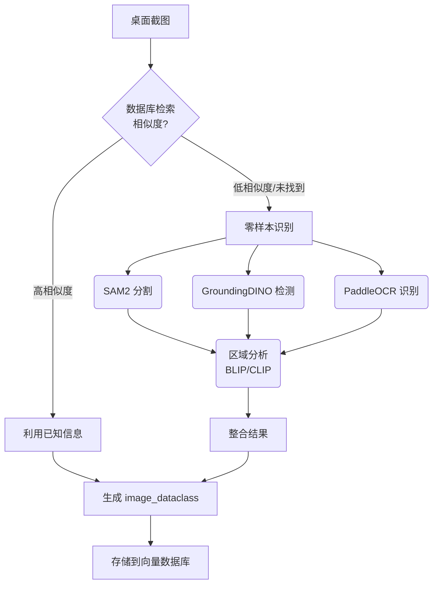

### 零样本图像识别与检索系统分析报告

#### 1. 项目主要目标和功能需求

本项目旨在构建一个零样本能力的图像知识库，核心目标为：

*   零样本图像识别能力: 在无需预先训练或极少样本的情况下，具备强大的图像内容识别能力。
*   强大的图像检索能力: 支持基于图像内容的检索，辅助少样本情况下的识别。
*   桌面代理功能: 部署为桌面端代理，能够捕获屏幕截图并进行处理。
*   业务逻辑: 实现截图内容的识别流程，优先进行数据库检索以判断是否为已知场景；如果相似度不高，则执行零样本识别。
*   图像推理和上下文理解: 根据识别结果和可能的上下文信息，具备一定的图像推理能力。
*   结构化存储: 将图像分析结果以 `image_dataclass` 格式存储到向量数据库中。
*   未来扩展: 支持与动作知识库、Langchain 集成，以及实现 GUI Agent 以自动化桌面任务。

---

#### 2. 关键技术、模型或工具

文档中提及了以下关键技术和模型，它们构成了系统的技术基石：

| 技术/模型         | 描述                                                                                                | 主要用途                                                                    | 关联文件             |
| :---------------- | :-------------------------------------------------------------------------------------------------- | :------------------------------------------------------------------------ | :------------------- |
| SAM2          | Segment Anything Model version 2，一个强大的零样本图像分割模型。                                                                     | 零样本图像分割，生成准确的图像区域掩码。                                                       | `image_analyse`, `Zero-Shot Segmentation` |
| GroundingDINO | 结合了 Grounding 和 DINO 的目标检测模型，支持基于文本描述进行开放词汇的目标检测。                                                              | 根据文本提示词（如 button, icon, text 等）检测图像中的物体。                                    | `image_analyse`      |
| BLIP / BLIP-2 | 多模态模型，用于图像字幕生成和视觉问答。文档中提到了 BLIP 和 BLIP-2 两个版本。                                                                  | 生成图像区域的自由文本描述，辅助理解区域内容。BLIP-2 在 `zeroshot_classify` 中用于区域描述。                             | `image_analyse`, `zeroshot_classify` |
| CLIP          | Contrastive Language–Image Pre-training，一个通过对比学习训练的视觉-语言模型，支持零样本图像分类。                                                     | 基于文本类别标签对图像区域进行零样本分类。                                                    | `zeroshot_classify`  |
| PaddleOCR     | 百度开源的光学字符识别（OCR）工具。                                                                              | 识别图像中的文本内容。                                                                   | `image_analyse`      |
| 向量数据库    | 用于存储和检索 `image_dataclass` 中的图像特征向量和关联信息。具体数据库类型未明确提及。                                                                | 支持基于特征相似度的图像检索（例如用于判断截图是否为已知场景）。                                                 | 用户需求, `Image Dataclass` |
| Langchain     | 用于构建语言模型应用的框架，有助于集成不同的模型和组件。                                                                | 未来规划，用于构建更复杂的代理行为和流程。                                                                   | 用户需求             |
| 动作知识库    | 用户需求中提及，用于存储和管理桌面操作相关的知识。                                                                     | 未来规划，与 GUI Agent 集成，实现自动化桌面任务。                                                               | 用户需求             |

```svg
<svg width="600" height="400" xmlns="http://www.w3.org/2000/svg">
  <!-- Nodes -->
  <rect x="250" y="10" width="100" height="40" rx="5" ry="5" fill="#f0f0f0" stroke="#333"/>
  <text x="300" y="35" font-family="Arial" font-size="14" text-anchor="middle" fill="#333">桌面截图</text>

  <rect x="50" y="100" width="120" height="40" rx="5" ry="5" fill="#a0d0f0" stroke="#333"/>
  <text x="110" y="125" font-family="Arial" font-size="14" text-anchor="middle" fill="#333">GroundingDINO</text>

  <rect x="240" y="100" width="120" height="40" rx="5" ry="5" fill="#a0d0f0" stroke="#333"/>
  <text x="300" y="125" font-family="Arial" font-size="14" text-anchor="middle" fill="#333">SAM2</text>

  <rect x="430" y="100" width="120" height="40" rx="5" ry="5" fill="#a0d0f0" stroke="#333"/>
  <text x="490" y="125" font-family="Arial" font-size="14" text-anchor="middle" fill="#333">PaddleOCR</text>

  <rect x="140" y="190" width="120" height="40" rx="5" ry="5" fill="#a0d0f0" stroke="#333"/>
  <text x="200" y="215" font-family="Arial" font-size="14" text-anchor="middle" fill="#333">BLIP/BLIP-2</text>

  <rect x="330" y="190" width="120" height="40" rx="5" ry="5" fill="#a0d0f0" stroke="#333"/>
  <text x="390" y="215" font-family="Arial" font-size="14" text-anchor="middle" fill="#333">CLIP</text>

  <rect x="250" y="290" width="100" height="50" rx="5" ry="5" fill="#f0f0a0" stroke="#333"/>
  <text x="300" y="305" font-family="Arial" font-size="14" text-anchor="middle" fill="#333">图像分析结果</text>
  <text x="300" y="325" font-family="Arial" font-size="14" text-anchor="middle" fill="#333">(image_dataclass)</text>

  <rect x="250" y="360" width="100" height="40" rx="5" ry="5" fill="#a0f0a0" stroke="#333"/>
  <text x="300" y="385" font-family="Arial" font-size="14" text-anchor="middle" fill="#333">向量数据库</text>

  <!-- Arrows -->
  <line x1="300" y1="50" x2="110" y2="100" stroke="#333" marker-end="url(#arrow)"/>
  <line x1="300" y1="50" x2="300" y2="100" stroke="#333" marker-end="url(#arrow)"/>
  <line x1="300" y1="50" x2="490" y2="100" stroke="#333" marker-end="url(#arrow)"/>

  <line x1="110" y1="140" x2="200" y2="190" stroke="#333" marker-end="url(#arrow)"/>
  <line x1="300" y1="140" x2="200" y2="190" stroke="#333" marker-end="url(#arrow)"/>
    <line x1="300" y1="140" x2="390" y2="190" stroke="#333" marker-end="url(#arrow)"/>
  <line x1="490" y1="140" x2="200" y2="190" stroke="#333" marker-end="url(#arrow)"/>


  <line x1="200" y1="230" x2="300" y2="290" stroke="#333" marker-end="url(#arrow)"/>
    <line x1="390" y1="230" x2="300" y2="290" stroke="#333" marker-end="url(#arrow)"/>


  <line x1="300" y1="340" x2="300" y2="360" stroke="#333" marker-end="url(#arrow)"/>

  <!-- Marker -->
  <defs>
    <marker id="arrow" markerWidth="10" markerHeight="10" refX="5" refY="5" orient="auto">
      <path d="M0 0 L10 5 L0 10 Z" fill="#333"/>
    </marker>
  </defs>
</svg>
```

*图 1: 图像分析流程简图*

---

#### 3. 系统架构概述

根据文档描述，系统的核心组件如下：

*   桌面代理 (Desktop Agent): 系统的入口点，捕获屏幕截图，协调后续的识别和检索流程。
*   零样本图像分析模块:
    *   零样本分割 (SAM2): 用于将图像分割为不同的区域。
    *   目标检测 (GroundingDINO): 根据文本提示词检测目标，辅助分割。
    *   OCR (PaddleOCR): 识别文本区域。
    *   区域分析 (BLIP/BLIP-2, CLIP): 对分割或检测到的区域进行描述和零样本分类。
*   图像知识库:
    *   向量数据库: 存储图像分析结果 (`image_dataclass`)，支持高效检索。

系统的主要交互流程体现了“识别出截图内容 -> 数据库检索 -> 零样本识别”的业务逻辑。不同模型协同工作，从图像中提取不同层次的信息（分割、检测、OCR、描述、分类），并将这些信息整合到结构化的 `image_dataclass` 中。

---

#### 4. 桌面代理功能与业务逻辑

具体功能:

*   截图捕获: 捕获桌面当前的可见内容作为输入图像。
*   流程协调: 根据业务逻辑，按顺序触发数据库检索和零样本识别过程。
*   结果处理: 接收并整合图像分析模块的输出。
*   知识库交互: 将新的分析结果存储到向量数据库，并执行检索操作。

核心业务逻辑流程:

1.  截图: 桌面代理捕获当前屏幕截图。
2.  数据库检索: 使用截图或从截图提取的全局特征，在向量数据库中进行相似度检索。
    *   *判断:* 如果检索到的相似度高的匹配项（例如，高于某个阈值），则认为这是已知的场景，可以利用数据库中已有的信息。这一步的设计细节（如使用何种全局特征进行检索，相似度阈值的确定方式）需进一步明确。
    *   *已知场景:* 可以直接使用数据库中存储的分析结果，甚至可以结合历史上下文进行推理。
    *   *未知场景:* 如果相似度不高，或未找到足够相似的匹配项，则执行零样本识别流程。
3.  零样本识别 (未知场景):
    *   图像预处理: 准备图像输入各模型。
    *   整体分析 (可选): 使用 BLIP 或 BLIP-2 等模型对整个截图进行初步描述。
    *   区域分割/检测: 使用 SAM2 进行零样本分割，同时可能结合 GroundingDINO 和预设的提示词（如 button, icon, text）进行目标检测。PaddleOCR 用于识别文本区域。
    *   区域分析: 对分割或检测到的每个区域，使用 BLIP/BLIP-2 生成描述，使用 CLIP 根据预设或上下文推断的类别进行零样本分类。将 OCR 结果关联到相应的区域。
    *   结果集成: 将所有区域的分析结果（描述、分类、OCR、位置信息）整合。
4.  生成 `image_dataclass`: 将整合后的分析结果按照 `ImageAnalysisResult` 结构进行组织。
5.  存储到向量数据库: 将生成的 `ImageAnalysisResult` 对象（特别是其中的特征向量）存储到向量数据库中，扩展知识库。

流程图:



*图 2: 桌面代理业务逻辑流程*

---

#### 5. 图像推理能力与上下文理解

文档中明确提到了“根据上下文，要有图像推理能力”。这表示系统不仅仅是简单地识别图像内容，还需要：

*   理解不同区域之间的关系: 例如，识别出一个按钮旁边是特定文本，或者一个图标代表某个功能。
*   结合历史交互信息: 如果这是用户在执行某个任务过程中的截图，系统可能需要知道之前的步骤或操作，以更好地理解当前界面的意义。
*   推断意图或状态: 根据识别出的UI元素（如选中的菜单项、已输入的文本框内容），推断用户可能的操作意图或应用程序的当前状态。

当前的文档主要聚焦于如何从图像中提取多层次的信息（分割、检测、描述、分类、OCR），这些信息是进行推理的基础。然而，关于“如何实现图像推理”以及“如何引入上下文信息”的具体机制，文档中尚未详细说明。这可能需要更高级别的逻辑层，结合知识图谱、规则引擎或更复杂的语言模型来实现对图像元素的语义理解和关联。BLIP-2 的视觉问答能力可能在此环节发挥作用，通过对区域或整体图像提问来获取更深入的理解。

---

#### 6. `image_dataclass` 设想及其与向量数据库的集成

*   `image_dataclass`: 文档详细定义了 `ImageInstance` 和 `ImageAnalysisResult` 两个 dataclass。
    *   `ImageInstance`: 存储单个图像（可以是原图或某个区域）的信息，包括像素数据 (`image`)，尺寸，来源 (`source` - 如 GroundingDINO, OCR)，类别名 (`class_name`)，文本描述 (`description`)，可能的掩码 (`mask`) 和掩码后的图像 (`mask_image`)。它不存储位置信息。
    *   `ImageAnalysisResult`: 存储对原始图像的完整分析结果，包含原始图像的 `ImageInstance` 以及一系列检测或分割出的子区域的 `ImageInstance`。通过 `bbox_list` 存储子区域相对于原始图像的边界框位置。
*   与向量数据库集成:
    *   `image_dataclass` 中的 文本描述 (`description`) 可以通过文本编码模型（如 CLIP 的文本端或独立的 Sentence Transformer）生成向量。
    *   `ImageInstance` 中的 图像本身或其特征 (例如通过 CLIP 的图像端生成) 可以生成向量。
    *   这些向量可以作为主键或索引存储在向量数据库中。
    *   与向量关联存储的信息可以包括 `image_dataclass` 的其他字段，如 `class_name`, `bbox`, `source` 等，或者指向完整 `ImageAnalysisResult` 对象的 ID。
    *   检索过程: 输入一个新的截图时，首先提取其全局图像特征向量或从截图中的文本、关键区域生成查询向量，然后在向量数据库中搜索相似的向量。相似度高的匹配项即为检索结果。

通过这种方式，向量数据库能够高效地支持基于图像内容（全局或局部特征）和文本描述的快速检索，从而实现“先从数据库中检索截图（如果相似度高，则可认为是同一场景）”的业务逻辑。

*   Potential `image_dataclass` structure for Vector DB storage consideration:

```latex
\boxed{
\begin{array}{l}
\textbf{Vector Database Entry} \\
\hline
\text{Global Image Vector} \\
\text{(e.g., CLIP image feature of the screenshot)} \\
+ \\
\textbf{Metadata:} \\
\quad \text{Original Image ID} \\
\quad \text{Timestamp (of capture)} \\
\quad \text{Overall Description (from BLIP)} \\
\quad \text{List of Instance Data:} \\
\quad \quad \bullet \text{Instance Vector (e.g., CLIP image feature of region)} \\
\quad \quad \bullet \text{Instance Class Name} \\
\quad \quad \bullet \text{Instance Description} \\
\quad \quad \bullet \text{Instance Bounding Box (relative to original)} \\
\quad \quad \bullet \text{Instance Source (GroundingDINO, OCR)} \\
\quad \quad \bullet \text{OCR Text (if applicable)} \\
\end{array}
}
```

---

#### 7. 未来扩展规划

文档明确指出了未来的扩展方向：

*   与动作知识库集成: 将图像知识库与关于如何执行桌面任务的动作知识库结合。这意味着系统不仅能“看懂”屏幕，还能知道如何与屏幕上的元素进行交互（例如，点击哪个按钮来执行某个操作）。
*   与 Langchain 集成: 利用 Langchain 框架，可以更灵活地编排各模型和工具的调用，构建复杂的代理行为链。Langchain 也擅长处理语言交互和任务规划，有助于将图像理解转化为具体的桌面操作指令。
*   GUI Agent 自动化桌面任务: 最终目标是构建一个能够自动感知、理解桌面环境并执行任务的 GUI Agent。这可能是通过结合图像识别结果、动作知识库和 Langchain 的任务规划能力来实现的。例如，识别出某个窗口中的特定按钮，然后根据动作知识库和当前任务目标，自动生成鼠标点击该按钮的操作。

这些扩展方向表明项目规划了一个从感知（图像识别）到认知（推理、规划）再到行动（自动化任务）的完整代理能力发展路径。

---

#### 8. 假设、挑战和未明确事项

假设:

*   模型可用性和性能: 假设文档中提到的预训练模型（SAM2, GroundingDINO, BLIP/BLIP-2, CLIP）性能稳定且能够满足项目需求，尤其是在桌面环境截图这种特定领域的表现。
*   计算资源: 假设有足够的计算资源（尤其是 GPU）来运行这些通常计算量较大的深度学习模型。
*   零样本能力有效性: 假设这些模型的零样本能力在桌面 UI 元素这一特定领域能够有效泛化，识别出用户界面中的各种组件和内容。

挑战:

*   桌面环境的复杂性: 桌面 UI 远比自然图像结构化，包含各种按钮、输入框、菜单、列表等，布局复杂且多变。如何准确识别这些细粒度的 UI 元素及其功能是挑战。
*   零样本识别的准确性和鲁棒性: 零样本能力虽然强大，但在面对之前从未见过的特定UI元素或复杂布局时，其准确性可能不如监督学习。如何处理误识别和漏识别？
*   图像推理的实现: 将图像识别结果提升到有意义的推理和理解层面是复杂的。如何定义推理规则或构建推理模型？如何有效融合上下文信息？
*   数据库检索与零样本识别的切换逻辑: “高相似度”的阈值如何确定？如何平衡检索速度和识别准确性？如果截图与数据库中的场景只有部分相似，如何处理？
*   GUI Agent 的动作执行精度和鲁棒性: 识别出 UI 元素后，如何精确、鲁棒地控制鼠标、键盘等执行操作？桌面环境的变化如何处理？
*   实时性要求: 桌面代理可能需要较快的响应速度，尤其是在进行自动化任务时。模型的推理速度是否满足需求？
*   数据标注: 虽然强调零样本，但在开发和评估阶段，仍然需要一定量的桌面截图数据以及对应的标注（例如区域、类别、描述），用于测试和验证模型的表现。

未明确事项:

*   向量数据库的具体选型: 使用哪种向量数据库（如 Faiss, Annoy, Milvus, Pinecone 等）？
*   图像特征提取策略: 使用何种模型或方法提取用于向量检索的全局和局部图像特征？
*   相似度检索的度量和阈值: 如何定义图像相似度？判断是否为“同一场景”的相似度阈值如何设定？
*   上下文信息的获取和表示: 如何获取桌面代理的上下文信息（如当前应用程序、用户之前的操作历史、剪贴板内容等）？如何在系统中表示和利用这些上下文？
*   图像推理的具体实现方法: 除了使用多模态模型，是否会结合符号推理、知识图谱或其他技术？
*   `image_dataclass` 到向量数据库的具体映射和存储细节: 哪些字段会生成向量，哪些作为元数据存储？如何保证数据的一致性和有效性？
*   模型的具体版本和训练数据: 文档提到了模型名称和检查点文件路径的环境变量，但未说明具体是哪个版本的模型以及它们是否在桌面UI数据上进行过微调（虽然强调零样本，但微调可能提升特定领域的性能）。PaddleOCR 在中文字符识别方面的表现如何？

这份分析报告总结了系统设计的核心要素和技术方向。后续的设计和实现需要进一步细化上述挑战和未明确事项，并进行相应的技术选型和实验验证。