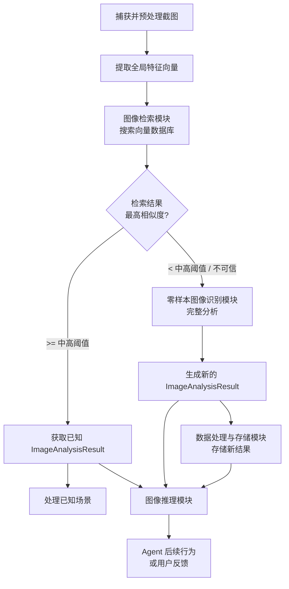

# 桌面端 Agent 核心业务逻辑与工作流程规划

## 1. 引言

本文基于已确认的系统架构设计、零样本图像识别模块、图像检索模块方案及用户需求，详细规划桌面端 Agent 的核心业务逻辑和工作流程。桌面端 Agent 作为系统的入口和协调者，负责屏幕捕获、流程调度、结果整合与交互，是整个系统实现桌面感知与智能的基础。

## 2. 截图捕获与预处理

 *（此处为占位图，实际应用中将根据实际过程绘制流程图）*

截图捕获是 Agent 工作流程的起点。需要考虑多种触发方式和灵活的捕获机制：

*   触发方式:
    *   快捷键触发: 设定全局快捷键（例如 Ctrl+Shift+S），用户按下快捷键时立即捕获当前屏幕。
    *   定时触发: 按照预设的时间间隔（例如每隔几秒或几十秒）自动捕获屏幕，用于持续监控桌面状态。
    *   特定事件触发:
        *   窗口焦点变化: 当用户切换活动窗口时触发捕获。
        *   应用程序启动/关闭: 监控特定应用程序的生命周期。
        *   鼠标/键盘 inactivity 结束: 在一段时间不活动后，用户进行输入或移动鼠标时触发，捕获当前状态。
*   捕获机制:
    *   全屏捕获: 捕获整个主屏幕或所有连接的屏幕内容。
    *   区域选择: 用户在按下快捷键后，Agent 提供一个可拖拽的选择框，用户框选感兴趣的屏幕区域进行捕获。这有助于聚焦特定窗口或UI元素，减少无关信息的干扰。可以使用如 PyGetWindow 库辅助获取窗口位置信息，方便快速框选或捕捉特定应用程序窗口。
*   图像预处理步骤:
    *   格式转换: 将捕获的图像（通常是 PNG 或 BMP）转换为统一格式进行后续处理，例如 RGB 格式的 Pillow Image 对象或 NumPy 数组，以便于各模型模块处理。
    *   尺寸调整: 根据下游模型（如某些模型的固定输入尺寸要求）或性能考虑，对图像进行缩放。保持宽高比以避免图像失真。
    *   归一化: 将像素值缩放到模型所需的范围内（例如 [0, 1] 或 [-1, 1]），并进行均值、标准差归一化，以匹配模型的训练数据分布。
    *   其他: 针对特定需求可能需要的步骤包括：灰度化（如果某些模型仅需灰度输入，尽管彩色通常包含更多信息）、裁剪（如果仅处理特定区域）。

工具选择: 结合 Reference 中提到的 Python 库，使用 `mss`（高性能跨平台）进行截图捕获，`Pillow` (PIL) 进行图像格式转换、尺寸调整等基本预处理。如果需要更精细的窗口或控件交互，或在 Windows 平台，可以结合 `pywinauto`。

## 3. 核心决策逻辑 (检索优先策略)

 *（此处为占位图，实际应用中将根据实际过程绘制流程图）*

Agent 捕获並预处理截图后，核心业务逻辑体现在如何决策是优先进行图像检索还是零样本识别。这实现了“如果相似度高，则可认为是同一场景，利用已知信息”的需求。

*   决策流程:

    1.  新截图输入: Agent 接收到预处理后的截图图像。
    2.  提取查询特征: 调用图像检索模块（或其内部封装的特征提取逻辑）提取当前截图的全局特征向量（例如 CLIP Image Encoder 输出）。
    3.  执行图像检索: 将查询特征向量发送给图像检索模块，在向量数据库中执行相似度搜索。设置返回的 top-k 数量（例如 5-10 个）以及一个初步的相似度阈值。
    4.  评估检索结果: 图像检索模块返回 Top-k 的 `RetrievalResultEntry` 列表，包含匹配项 ID、相似度得分和部分关键元数据。
    5.  相似度阈值判断: Agent 检查最高相似度得分 (`RetrievalResultEntry[0].similarity_score`)。这是核心决策点。
        *   是否优先进行快速检索？ 是。这是 Agent 的核心策略：Low Latency First。如果在知识库中能快速找到相似场景，则可以显著减少调用计算密集型零样本识别模块的时间，提高响应速度。
        *   检索结果的相似度阈值 (`similarity_threshold`) 如何设定以判断为“同一场景”？
            *   这是一个关键参数，需要在实际数据上进行实验调优。
            *   高阈值 (例如 0.95+ 余弦相似度): 判断为“像素级相似”或“非常高的视觉相似度”。这种情况下，可以高度确信是同一场景，直接复用已知 `ImageAnalysisResult` 中的所有信息（边界框、类别、描述、OCR文本）而无需重新分析。
            *   中高阈值 (例如 0.8 - 0.95 余弦相似度): 判断为“高度相似的场景”或“同一应用程序内的相似界面”。此时，可以认为主要 UI 元素和布局很可能相同，可以复用已知分析结果中的结构信息（如哪些位置有什么类型的控件），但可能需要部分验证或微调（例如，如果文本内容有变化，需要重新进行 OCR；如果某个元素的描述需要更新，可以使用 BLIP/BLIP-2 对该特定区域进行分析）。这仍比完整零样本识别快。这个阈值需要根据对“相似场景”的定义和可接受的误判率来确定。
            *   低于中高阈值: 认为是不够相似的场景，不能直接复用已有的详细分析结果。
        *   何时判定检索失败或结果不足以采信，从而启动零样本识别？ 当最高相似度得分低于设定的“中高阈值”时， Agent 判定检索结果不足以采信整个已知分析结果。或者，即使高于中高阈值，如果检索返回的元数据（例如应用程序名称与当前活动窗口不符）存在冲突，也可以判定为结果不可信，启动零样本识别。
    6.  根据判断结果分流:
        *   如果最高相似度 >= 中高阈值: Agent 从数据处理与存储模块根据匹配的 ID 获取完整或部分的已知 `ImageAnalysisResult` 对象。流程转到“处理已知场景”。
        *   如果最高相似度 < 中高阈值: Agent 调用零样本图像识别模块对当前截图进行完整的零样本分析。流程转到“处理未知场景”。
*   并行执行或根据初步识别结果调整检索参数？
    *   初步不建议并行执行核心识别/检索路径: 零样本识别（尤其是涉及 SAM2 等大模型）是计算密集型任务，与向量检索（虽然快但也消耗一定资源）并行可能会显著增加整体资源占用和热度。目前的策略是 sequential 的：先快速检索，若失败再进行慢速但全面的识别。
    *   根据初步识别结果调整检索参数: 这是一种进阶策略，可以在后续版本考虑。例如，如果零样本识别模块初步识别出截图属于某个特定应用程序（通过窗口标题或识别出应用程序图标），可以在后续的检索查询中添加元数据过滤条件，限定只在数据库中搜索该应用程序相关的截图，可能提高检索效率和准确性。或者，如果初步识别出包含用户指定的特定元素（如搜索框），可以提取该元素的向量并进行区域级检索。但这增加了决策逻辑的复杂性。

决策逻辑图示:



*图4：Agent 核心决策与流程图*

## 4. 上下文感知与图像推理

图像推理模块的职责是根据已有的视觉识别和检索结果，结合上下文信息进行深层次的理解和判断。Agent 需要负责收集和提供这些上下文信息给推理模块。

*   需要整合的上下文信息:
    *   当前活动应用程序信息: 活动窗口的标题、exe 名称、进程 ID。这是判断用户所处环境最重要的信息之一。可以使用如 `pygetwindow` 或系统原生 API 获取。
    *   鼠标指针位置: 用户在截图时的鼠标位置可能指示用户的关注点或即将交互的元素。
    *   最近的用户输入: 键盘输入历史、剪贴板内容，可能与界面中的文本输入框相关。
    *   历史截图序列: 前几秒或前几分钟的截图及其分析结果。这有助于理解用户正在执行的任务步骤，例如判断当前界面是某个多步操作的中间状态。
    *   Agent 内部状态: Agent 当前正在执行的任务、目标，这有助于推理模块理解用户行为的意图。
    *   时间/日期: 有时界面的内容或用户行为与时间相关。
*   如何辅助图像内容的理解和推理:
    *   缩小识别范围: 例如，如果上下文显示当前是文件管理器窗口，推理模块可以更倾向于将识别出的图标分类为“文件夹图标”、“文件图标”，而非其他应用中的图标。
    *   消除识别结果的歧义: 零样本识别的结果可能不确定。例如，BLIP 可能对一个区域描述为“包含文本的矩形”。如果上下文显示这是在一个表格控件内部，推理模块可以推理这很可能是一个表格单元格。如果 OCR 识别出框内文本是日期，且上下文是航班预订界面，推理模块可以推断这是一个日期选择器的一部分。
    *   理解元素功能: 结合应用程序类型和位置，推断出某个按钮的具体功能（例如，在浏览器中导航栏附近的“刷新”图标）。
    *   推断用户意图: 综合识别出的 UI 元素、鼠标位置、当前任务等信息，判断用户可能想要执行的操作（例如，选中了一个文本框，然后鼠标悬停在“复制”按钮上，可能意图是复制文本）。
*   Agent 在此环节的角色: Agent 作为信息收集者和协调者，负责从操作系统、历史记录等渠道获取各种上下文信息，并将截图分析/检索结果与这些上下文信息打包，以标准格式发送给图像推理模块。

## 5. `image_dataclass` 细化与扩展

在图像检索模块方案中已经初步定义了 `ImageInstance` 和 `ImageAnalysisResult` 的结构。结合零样本识别模块的输出和 Agent 对上下文的需求，我们需要进一步细化和确认这些数据结构，确保其能存储所有必要的信息。

Reference 中的 `ImageAnalysisResult` 和 `ImageInstance` 定义是很好的基础。在此基础上进行细化，考虑增加 Agent 特定的字段：

```python
# image_data_structures.py (Final Adjusted Structure)
from dataclasses import dataclass, field
from typing import Optional, List, Tuple, Any
# Use PIL.Image for image data as it's commonly used with vision models and is serialization friendly (e.g., save to bytes)
from PIL import Image
from datetime import datetime
import numpy as np

@dataclass
class ImageInstance:
    """
    Stores information and analysis results for a standalone image or region.
    Includes position/shape relative to its source (original image for regions).
    """
    # Identification and Source
    id: str = field(default_factory=lambda: str(uuid.uuid4())) # Unique ID for the instance/region
    source: str # e.g., "original_image", "GroundingDINO", "SAM2", "OCR"
    source_model: Optional[str] = None # Model used, e.g., "SAM2", "GroundingDINO", "PaddleOCR", "CLIP", "BLIP"

    # Image Data and Position (Relative to its parent, parent=original for regions)
    # Store as bytes or path to saved file for efficient storage on disk/DB
    # Decision: Store as path/ID, and load Image.Image only when needed for processing
    image_path_or_id: str # Path to saved cropped image file or ID in a separate storage
    bbox: Optional[Tuple[int, int, int, int]] = None # Bounding box [x0, y0, x1, y1] relative to the original image
                                                     # Optional for the original_image instance itself, but can be used to denote the full frame [0,0,W,H]
    mask_path_or_id: Optional[str] = None # Path to saved mask file or ID in a separate storage (e.g., NPZ, PNG mask)

    # Analysis Results (Direct Model Outputs)
    class_name: Optional[str] = None # Classification result (e.g., "button", "text_input") from CLIP or GroundingDINO
    description: Optional[str] = None # Text description generated by BLIP/BLIP-2
    ocr_text: Optional[str] = None # OCR recognized text within the bbox/mask
    confidence: Optional[float] = None # Confidence score from the model (detection, classification, etc.)

    # Feature Vector for Retrieval/Similarity
    vector: Optional[List[float]] = field(default_factory=list) # Feature vector for retrieval (e.g., CLIP embedding). Store as List for JSON/DB compatibility.

    # Structured Metadata (Potentially added by post-processing or fusion)
    ui_type: Optional[str] = None # More structured UI element type (e.g., "checkbox", "slider", "menu_item") - often inferred from multiple sources
    associated_text_id: Optional[str] = None # ID of associated text block (e.g., a label next to an input box)

    # Optional: Reference to original, less processed outputs if needed for debugging
    # raw_outputs: Optional[Dict[str, Any]] = None

@dataclass
class RetrievalMetadata(ImageInstance):
    """
    Inherit from ImageInstance or defined separately.
    Metadata returned by retrieval, could be a subset of ImageInstance fields
    for faster transmission, plus similarity score.
    """
    similarity_score: float
    original_image_analysis_id: str # Link back to the full analysis result ID

@dataclass
class ImageAnalysisResult:
    """
    Aggregates analysis of an original image and its sub-instances with relative positions.
    Represents one complete analysis of a single screenshot.
    """
    id: str = field(default_factory=lambda: str(uuid.uuid4())) # Unique ID for this analysis result
    original_image_path_or_id: str # Path to saved full screenshot or ID in storage
    global_vector: Optional[List[float]] = field(default_factory=list) # Feature vector for the entire original image
    timestamp: datetime = field(default_factory=datetime.now) # Timestamp of analysis or capture

    # Desktop Environment Context (Collected by Agent)
    application_name: Optional[str] = None # e.g., "Google Chrome", "explorer.exe"
    window_title: Optional[str] = None # Window title at the time of capture
    mouse_position: Optional[Tuple[int, int]] = None # Mouse coordinates at the time of capture
    # Add other context like historical_screenshot_ids, active_task_id, etc.

    region_instances: List[ImageInstance] = field(default_factory=list) # List of analyzed regions/UI elements

    # Retrieval Information (If this result was derived from or matched by retrieval)
    retrieved_from_id: Optional[str] = None # If this is a result loaded from DB based on retrieval match
    retrieval_match_score: Optional[float] = None # Similarity score if loaded from retrieval

    # Inference Results (Added by Inference Module)
    inferred_user_intent: Optional[str] = None # e.g., "fill form", "save file"
    inferred_ui_state: Optional[str] = None # e.g., "login page", "file dialog open"
    suggested_actions: Optional[List[Dict[str, Any]]] = field(default_factory=list) # List of potential actions (e.g., [{"action": "click", "target_instance_id": "..."}])

```

关键变动与考虑:

*   `ImageInstance`:
    *   增加了 `id` 作为唯一标识，方便在列表中引用或关联。
    *   `image` 字段改为 `image_path_or_id`。直接在 dataclass 中存储原始图像像素数据会使得对象非常大，不利于在模块间传递和数据库存储。改为存储文件路径或在单独的 Blob/文件存储系统中的 ID，需要时再按需加载像素数据。原图和掩码同理。
    *   增加了 `source_model` 字段，区分是哪个模型产生了该 instance (例如，GroundingDINO 检测结果，SAM2 分割区域，OCR 文本区域)。
    *   `vector` 字段类型从 `np.ndarray` 改为 `List[float]`。 NumPy 数组不直接支持 JSON 序列化和许多数据库的原生存储类型。存储为 Python list of float 更方便与 JSON、向量数据库（通常支持 float array 或 list）集成。
    *   增加了 `ui_type` 等结构化元数据字段，可以在模型输出后通过后处理逻辑填充，提供更规范的 UI 元素分类。
*   `ImageAnalysisResult`:
    *   增加了 `id` 作为整个分析结果的唯一标识。
    *   `original_image` 字段改为 `original_image_path_or_id`，理由同上。
    *   增加了 `global_vector` 字段存储整张图的特征。这与 `ImageInstance.vector` 分开，明确全局和局部特征的用途。
    *   增加了 桌面环境上下文 相关的字段 (`application_name`, `window_title`, `mouse_position` 等)。这些信息由 Agent 捕获并填充。
    *   增加了推理结果相关的字段 (`inferred_user_intent`, `inferred_ui_state`, `suggested_actions`)。这由推理模块填充，并提供给 Agent 指导后续行为。
    *   增加了 检索信息 字段 (`retrieved_from_id`, `retrieval_match_score`)。如果当前的 `ImageAnalysisResult` 是从数据库中根据检索结果加载而非重新分析生成，这些字段记录其来源，方便追溯和理解。

## 6. 向量数据库存储与查询方案

根据细化后的 `image_dataclass` 结构和图像检索模块方案，详细规划向量数据库的存储和查询：

*   选定的向量数据库: 继续以 Milvus 或 Qdrant 为例进行规划，假设其支持结构化元数据和高效 ANN 索引 (HNSW)。
*   数据模型和存储结构:
    *   可以设计一个或多个 Collection (表)。一种可行方案：
        *   Collection 1: `image_analysis_results`:
            *   存储每个 `ImageAnalysisResult` 对象的核心信息。
            *   向量字段: `global_vector` (Vector type, e.g., FLOAT_VECTOR, dimension matching CLIP output). 创建 HNSW 索引在此字段上。
            *   主键: `id` (String 或 Integer type, primary key).
            *   元数据字段: `original_image_path_or_id`, `timestamp`, `application_name`, `window_title`, `mouse_position`, `retrieved_from_id`, `retrieval_match_score`, `inferred_user_intent`, `inferred_ui_state`. Add these as scalar fields (String, DateTime, Float, Integer, etc.).
        *   Collection 2: `region_instances`:
            *   存储每个 `ImageInstance` 的信息 (除了原始截图的 ImageInstance)。
            *   向量字段: `vector` (Vector type). 创建 HNSW 索引在此字段上，用于区域级检索。
            *   主键: `id` (String or Integer type, primary key).
            *   元数据字段: `original_image_analysis_id` (String/Integer type, Foreign Key linking back to Collection 1), `source`, `source_model`, `image_path_or_id` (for cropped region), `bbox`, `mask_path_or_id`, `class_name`, `description`, `ocr_text`, `confidence`, `ui_type`, `associated_text_id`. Add these as scalar fields.
    *   索引构建策略:
        *   为 `image_analysis_results.global_vector` 创建 HNSW 索引：支持全局场景相似度检索。
        *   为 `region_instances.vector` 创建 HNSW 索引：支持区域级相似度检索（例如，找所有看起来像按钮的区域）。
        *   为关键元数据字段创建支持过滤的索引（例如，在 `application_name`, `window_title`, `timestamp` 字段上创建 B-tree 或其他标量索引），以便在向量检索时进行高效的元数据过滤。
*   桌面Agent如何根据业务逻辑高效查询:
    1.  主流程查询 (检索优先):
        *    Agent 捕获新截图，提取其全局特征向量，作为查询向量。
        *   调用图像检索模块的 `search_vector` API，查询 `image_analysis_results` Collection 的 `global_vector` 字段。
        *   查询参数：`query_vector` (新截图的全局特征), `k` (例如 Top-k=10), `similarity_metric` (Cosine), 可选地添加元数据过滤条件。例如，Agent 可以附带当前窗口的应用程序名称和标题作为过滤条件，如 `filter={"application_name": "Chrome", "window_title": {"$like": "Tab Title%"}}`，限定只在数据库中搜索该应用程序/窗口下的相似场景，这可以显著提高检索效率和相关性。
        *   图像检索模块接收查询结果（`List[RetrievalResultEntry]`）。Agent 基于其中的相似度得分和元数据（例如，检查匹配结果的 `application_name` 是否与当前一致）进行决策（高相似度 -> 复用 / 低相似度 -> 零样本识别）。
    2.  区域级查询 (潜在需求):
        *   未来可能需要根据某个识别出的区域（例如，用户用框选工具指定了一个区域）查找相似区域或包含该区域的场景。
        *    Agent 或图像推理模块可以提取该区域的特征向量。
        *   调用图像检索模块 `search_vector` API，查询 `region_instances` Collection 的 `vector` 字段。
        *   查询参数：`query_vector` (区域特征), `k`, `similarity_metric`, 以及元数据过滤（例如，`filter={"class_name": "button"}` 只搜索已知为按钮的区域，或 `filter={"original_image_analysis_id": "..."}` 在特定已知场景的所有区域中搜索）。
    3.  混合查询 (向量 + 元数据):
        *   得益于 Milvus/Qdrant 对结构化数据的支持，可以在一次查询中同时考虑向量相似度和元数据条件。例如，搜索与当前截图相似，并且 `application_name` 是“Word”或 `timestamp` 在过去一周内的场景。这使得检索更加灵活和精准。Agent 可以根据任务需求构建复杂的过滤条件。

## 7. 与各模块的交互

重申桌面Agent与各核心模块的 API 调用和数据交换：

*   与图像检索模块:
    *   Agent -> 检索模块: 调用 `search_similar(image_bytes: bytes, top_k: int, similarity_threshold: Optional[float] = None, filter_criteria: Optional[dict] = None) -> List[RetrievalResultEntry]`。Agent 传入截图的 bytes 数据和查询参数（包括可选的上下文过滤）。
    *   检索模块 -> Agent: 返回 `RetrievalResultEntry` 列表。Agent 根据列表的第一个元素的相似度得分和元数据进行后续流程决策。
    *   数据交换格式: 截图为 `bytes`，查询参数为标准 Python 类型 (`int`, `float`, `str`, `dict`)，返回结果为结构化的 `List[RetrievalResultEntry]`。
*   与零样本图像识别模块:
    *   Agent -> 识别模块: 调用 `analyze_screenshot(image_data: bytes, prompts: Optional[List[str]] = None, target_boxes: Optional[List[List[int]]] = None, target_points: Optional[List[List[int]]] = None) -> ImageAnalysisResult`。Agent 传入截图的 bytes 数据，可选地提供 Prompt 或区域信息（这部分可能由推理模块生成）。
    *   识别模块 -> Agent: 返回完整的 `ImageAnalysisResult` 对象。
    *   数据交换格式: 截图为 `bytes`，可选参数为 Python list，返回结果为结构化的 `ImageAnalysisResult` dataclass 对象。
*   与数据处理与存储模块 (特别是向量数据库交互):
    *   Agent -> 存储模块: 当零样本识别完成新截图的分析后，Agent 调用存储模块的 `store_analysis_result(result: ImageAnalysisResult) -> str` API，将 `ImageAnalysisResult` 对象传入。
    *   存储模块 -> Agent: 返回存储成功后的记录 ID。
    *   Agent 还可能需要调用存储模块的 API 根据检索到的 ID `get_analysis_result_by_id(id: str) -> ImageAnalysisResult` 来获取已知场景的完整分析结果。
    *   Agent 可能间接通过检索模块与向量数据库交互: 如第6节所述，Agent 构建过滤条件，通过检索模块的 API 传递给底层数据库。
    *   数据交换格式: 存储/获取为 `ImageAnalysisResult` 对象，ID 为字符串。
*   与图像推理模块:
    *   Agent -> 推理模块: 调用 `infer_from_context(image_analysis: ImageAnalysisResult, retrieval_results: Optional[List[RetrievalResultEntry]], context: Dict[str, Any]) -> Dict[str, Any]`。Agent 将当前的完整分析结果（如果是零样本识别生成的）或从数据库加载的已知分析结果，以及检索到的次优匹配结果（如果需要辅助推理），以及收集到的桌面环境上下文信息，打包传入。
    *   推理模块 -> Agent: 返回推理结果，例如一个包含 `user_intent`, `ui_state`, `suggested_actions` 等字段的字典。
    *   数据交换格式: 输入通常是 `ImageAnalysisResult` 对象（或其 ID，推理模块再加载）、`List[RetrievalResultEntry]`、标准 Python 字典；输出为标准 Python 字典。

总结: Agent 核心逻辑围绕“截图捕获 -> 检索 -> 评估 -> (复用已知 OR 零样本识别) -> 存储 -> 推理 -> 执行或反馈”轴线展开。Agent 是流程调度中心，负责收集多源信息（截图、上下文、用户输入），并协调调用各专业模块完成感知、检索、分析和推理任务。数据流主要以 `bytes` (截图)、结构化 `dataclass` (分析结果) 和 `List[RetrievalResultEntry]` (检索结果) 为载体在模块间传递。与向量数据库的直接交互主要由数据处理与存储模块封装。
